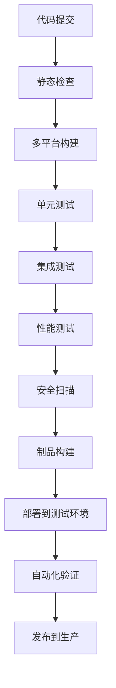

# CI/CD流程设计

## 概述

本文档定义了C++跨平台SDK项目的持续集成和部署流程，基于业界最佳实践和真实案例，确保代码质量和发布可靠性。

## CI/CD架构设计

### 流水线概览


### 分支策略
```
main (生产分支)
├── develop (开发分支)
├── feature/* (功能分支)
├── release/* (发布分支)
└── hotfix/* (热修复分支)
```

## 多平台构建策略

### 1. 构建矩阵配置

#### GitHub Actions配置
```yaml
name: Multi-Platform CI

on:
  push:
    branches: [ main, develop ]
  pull_request:
    branches: [ main, develop ]

jobs:
  build-and-test:
    strategy:
      fail-fast: false
      matrix:
        include:
          # Linux构建
          - os: ubuntu-20.04
            compiler: gcc-9
            build_type: Debug
            arch: x64
          - os: ubuntu-20.04
            compiler: gcc-9
            build_type: Release
            arch: x64
          - os: ubuntu-20.04
            compiler: clang-12
            build_type: Debug
            arch: x64
            
          # Windows构建
          - os: windows-2019
            compiler: msvc2019
            build_type: Debug
            arch: x64
          - os: windows-2019
            compiler: msvc2019
            build_type: Release
            arch: x64
          - os: windows-2019
            compiler: msvc2019
            build_type: Release
            arch: x86
            
          # macOS构建
          - os: macos-11
            compiler: clang
            build_type: Debug
            arch: x64
          - os: macos-11
            compiler: clang
            build_type: Release
            arch: x64
          - os: macos-11
            compiler: clang
            build_type: Release
            arch: arm64
            
    runs-on: ${{ matrix.os }}
    
    steps:
      - name: Checkout
        uses: actions/checkout@v3
        with:
          submodules: recursive
          
      - name: Setup Build Environment
        run: |
          ./scripts/setup_build_env.sh ${{ matrix.compiler }}
          
      - name: Configure CMake
        run: |
          cmake -B build \
            -DCMAKE_BUILD_TYPE=${{ matrix.build_type }} \
            -DCMAKE_ARCHITECTURE=${{ matrix.arch }} \
            -DENABLE_TESTING=ON \
            -DENABLE_COVERAGE=${{ matrix.build_type == 'Debug' && 'ON' || 'OFF' }}
            
      - name: Build
        run: cmake --build build --config ${{ matrix.build_type }} -j
        
      - name: Run Tests
        run: |
          cd build
          ctest --output-on-failure --parallel 4
```

### 2. 移动平台构建

#### Android构建配置
```yaml
  android-build:
    runs-on: ubuntu-latest
    strategy:
      matrix:
        api-level: [21, 28, 30]
        arch: [armeabi-v7a, arm64-v8a, x86, x86_64]
        
    steps:
      - name: Setup Android NDK
        uses: nttld/setup-ndk@v1
        with:
          ndk-version: r23c
          
      - name: Configure for Android
        run: |
          cmake -B build-android \
            -DCMAKE_TOOLCHAIN_FILE=$ANDROID_NDK_ROOT/build/cmake/android.toolchain.cmake \
            -DANDROID_ABI=${{ matrix.arch }} \
            -DANDROID_PLATFORM=android-${{ matrix.api-level }} \
            -DCMAKE_BUILD_TYPE=Release
            
      - name: Build for Android
        run: cmake --build build-android -j
```

#### iOS构建配置
```yaml
  ios-build:
    runs-on: macos-latest
    strategy:
      matrix:
        platform: [iphoneos, iphonesimulator]
        arch: [arm64, x86_64]
        
    steps:
      - name: Configure for iOS
        run: |
          cmake -B build-ios \
            -DCMAKE_TOOLCHAIN_FILE=cmake/ios.toolchain.cmake \
            -DPLATFORM=${{ matrix.platform }} \
            -DARCHS=${{ matrix.arch }} \
            -DCMAKE_BUILD_TYPE=Release
            
      - name: Build for iOS
        run: cmake --build build-ios -j
```

## 质量检查流水线

### 1. 静态代码分析

#### 多工具集成
```yaml
  static-analysis:
    runs-on: ubuntu-latest
    steps:
      - name: Clang Static Analyzer
        run: |
          scan-build cmake --build build
          
      - name: Clang-Tidy
        run: |
          clang-tidy src/**/*.cpp -checks='-*,readability-*,performance-*,modernize-*,bugprone-*'
          
      - name: Cppcheck
        run: |
          cppcheck --enable=all --std=c++17 --platform=unix64 src/
          
      - name: PVS-Studio (if available)
        run: |
          pvs-studio-analyzer trace -- cmake --build build
          pvs-studio-analyzer analyze
          
      - name: SonarQube Analysis
        uses: sonarqube-quality-gate-action@master
        env:
          SONAR_TOKEN: ${{ secrets.SONAR_TOKEN }}
```

### 2. 安全扫描

#### 依赖漏洞扫描
```yaml
  security-scan:
    runs-on: ubuntu-latest
    steps:
      - name: Dependency Vulnerability Scan
        run: |
          # 扫描Conan依赖
          conan install . --build=missing
          safety check
          
      - name: SAST Scan
        uses: github/codeql-action/analyze@v2
        with:
          languages: cpp
          
      - name: Container Security Scan
        if: contains(github.event_name, 'push')
        run: |
          docker build -t sdk-test .
          trivy image sdk-test
```

### 3. 内存和线程安全检查

#### Sanitizer集成
```yaml
  sanitizer-tests:
    runs-on: ubuntu-latest
    strategy:
      matrix:
        sanitizer: [address, thread, memory, undefined]
        
    steps:
      - name: Build with ${{ matrix.sanitizer }} sanitizer
        run: |
          cmake -B build-${{ matrix.sanitizer }} \
            -DCMAKE_BUILD_TYPE=Debug \
            -DENABLE_$(echo ${{ matrix.sanitizer }} | tr '[:lower:]' '[:upper:]')_SANITIZER=ON
          cmake --build build-${{ matrix.sanitizer }} -j
          
      - name: Run tests with sanitizer
        run: |
          cd build-${{ matrix.sanitizer }}
          ctest --output-on-failure
        env:
          ASAN_OPTIONS: detect_leaks=1:abort_on_error=1
          TSAN_OPTIONS: halt_on_error=1
          MSAN_OPTIONS: halt_on_error=1
          UBSAN_OPTIONS: halt_on_error=1
```

## 自动化测试集成

### 1. 测试执行策略

#### 分层测试执行
```yaml
  test-execution:
    runs-on: ${{ matrix.os }}
    needs: build-and-test
    strategy:
      matrix:
        os: [ubuntu-latest, windows-latest, macos-latest]
        test-type: [unit, integration, performance]
        
    steps:
      - name: Run ${{ matrix.test-type }} tests
        run: |
          case "${{ matrix.test-type }}" in
            "unit")
              ctest -L unit --output-on-failure
              ;;
            "integration")
              ctest -L integration --output-on-failure
              ;;
            "performance")
              ctest -L performance --output-on-failure
              ./scripts/performance_regression_check.sh
              ;;
          esac
```

### 2. 测试报告生成

#### 统一测试报告
```yaml
  test-reporting:
    runs-on: ubuntu-latest
    needs: test-execution
    if: always()
    
    steps:
      - name: Collect Test Results
        run: |
          mkdir -p test-reports
          find . -name "*.xml" -path "*/test-results/*" -exec cp {} test-reports/ \;
          
      - name: Generate Coverage Report
        run: |
          lcov --capture --directory . --output-file coverage.info
          lcov --remove coverage.info '/usr/*' '*/tests/*' --output-file coverage.info
          genhtml coverage.info --output-directory coverage-report
          
      - name: Upload Test Results
        uses: actions/upload-artifact@v3
        with:
          name: test-results
          path: test-reports/
          
      - name: Upload Coverage Report
        uses: actions/upload-artifact@v3
        with:
          name: coverage-report
          path: coverage-report/
          
      - name: Publish Test Results
        uses: EnricoMi/publish-unit-test-result-action@v2
        if: always()
        with:
          files: test-reports/*.xml
          
      - name: Comment Coverage on PR
        if: github.event_name == 'pull_request'
        uses: 5monkeys/cobertura-action@master
        with:
          path: coverage.xml
          minimum_coverage: 80
```

## 制品管理和发布

### 1. 制品构建

#### 多平台制品打包
```yaml
  artifact-build:
    runs-on: ${{ matrix.os }}
    needs: [test-execution, security-scan]
    strategy:
      matrix:
        include:
          - os: ubuntu-latest
            platform: linux
            arch: x64
          - os: windows-latest
            platform: windows
            arch: x64
          - os: macos-latest
            platform: macos
            arch: universal
            
    steps:
      - name: Package Artifacts
        run: |
          cmake --build build --target package
          
      - name: Create Platform Package
        run: |
          mkdir -p packages/${{ matrix.platform }}-${{ matrix.arch }}
          cp build/*.tar.gz packages/${{ matrix.platform }}-${{ matrix.arch }}/
          cp build/*.zip packages/${{ matrix.platform }}-${{ matrix.arch }}/ || true
          
      - name: Upload Artifacts
        uses: actions/upload-artifact@v3
        with:
          name: sdk-${{ matrix.platform }}-${{ matrix.arch }}
          path: packages/${{ matrix.platform }}-${{ matrix.arch }}/
```

### 2. 自动化发布

#### 版本发布流程
```yaml
  release:
    runs-on: ubuntu-latest
    needs: artifact-build
    if: startsWith(github.ref, 'refs/tags/v')
    
    steps:
      - name: Download All Artifacts
        uses: actions/download-artifact@v3
        
      - name: Create Release
        uses: actions/create-release@v1
        env:
          GITHUB_TOKEN: ${{ secrets.GITHUB_TOKEN }}
        with:
          tag_name: ${{ github.ref }}
          release_name: Release ${{ github.ref }}
          draft: false
          prerelease: false
          
      - name: Upload Release Assets
        run: |
          for artifact in sdk-*; do
            zip -r "${artifact}.zip" "${artifact}/"
            gh release upload ${{ github.ref }} "${artifact}.zip"
          done
        env:
          GITHUB_TOKEN: ${{ secrets.GITHUB_TOKEN }}
```

## 部署和验证

### 1. 测试环境部署

#### 自动化部署脚本
```bash
#!/bin/bash
# scripts/deploy_to_test.sh

set -e

ENVIRONMENT=${1:-staging}
VERSION=${2:-latest}

echo "Deploying SDK version $VERSION to $ENVIRONMENT environment"

# 下载制品
wget "https://github.com/xuzhiwang/WorkReview/releases/download/$VERSION/sdk-linux-x64.zip"
unzip sdk-linux-x64.zip

# 部署到测试环境
docker build -t sdk-test:$VERSION .
docker run -d --name sdk-test-$VERSION sdk-test:$VERSION

# 等待服务启动
sleep 30

# 运行冒烟测试
./scripts/smoke_tests.sh

echo "Deployment completed successfully"
```

### 2. 生产环境发布

#### 蓝绿部署策略
```yaml
  production-deploy:
    runs-on: ubuntu-latest
    needs: release
    environment: production
    
    steps:
      - name: Deploy to Blue Environment
        run: |
          ./scripts/deploy_blue_green.sh blue ${{ github.ref }}
          
      - name: Run Health Checks
        run: |
          ./scripts/health_check.sh blue
          
      - name: Switch Traffic to Blue
        run: |
          ./scripts/switch_traffic.sh blue
          
      - name: Monitor Deployment
        run: |
          ./scripts/monitor_deployment.sh 300  # 监控5分钟
```

## 质量门禁和回滚

### 1. 质量门禁标准

#### 自动化质量检查
```yaml
  quality-gate:
    runs-on: ubuntu-latest
    needs: [test-reporting, security-scan]
    
    steps:
      - name: Check Quality Metrics
        run: |
          # 检查测试覆盖率
          COVERAGE=$(grep -o 'line-rate="[^"]*"' coverage.xml | cut -d'"' -f2)
          if (( $(echo "$COVERAGE < 0.80" | bc -l) )); then
            echo "Coverage $COVERAGE is below 80% threshold"
            exit 1
          fi
          
          # 检查测试通过率
          PASS_RATE=$(python scripts/calculate_pass_rate.py test-reports/)
          if (( $(echo "$PASS_RATE < 0.95" | bc -l) )); then
            echo "Test pass rate $PASS_RATE is below 95% threshold"
            exit 1
          fi
          
          # 检查性能回归
          python scripts/performance_regression_check.py
```

### 2. 自动回滚机制

#### 回滚触发条件
```bash
#!/bin/bash
# scripts/auto_rollback.sh

# 监控关键指标
ERROR_RATE=$(curl -s "http://monitoring/api/error_rate" | jq '.value')
RESPONSE_TIME=$(curl -s "http://monitoring/api/response_time" | jq '.value')

# 检查是否需要回滚
if (( $(echo "$ERROR_RATE > 0.05" | bc -l) )) || (( $(echo "$RESPONSE_TIME > 1000" | bc -l) )); then
    echo "Critical metrics exceeded threshold, initiating rollback"
    
    # 执行回滚
    ./scripts/rollback_deployment.sh
    
    # 发送告警
    curl -X POST "$SLACK_WEBHOOK" -d "{\"text\":\"Auto rollback triggered due to high error rate or response time\"}"
fi
```

---

> 🔄 **持续优化**: CI/CD流程需要根据项目发展和团队反馈持续优化，定期评估和改进各个环节的效率和质量。
