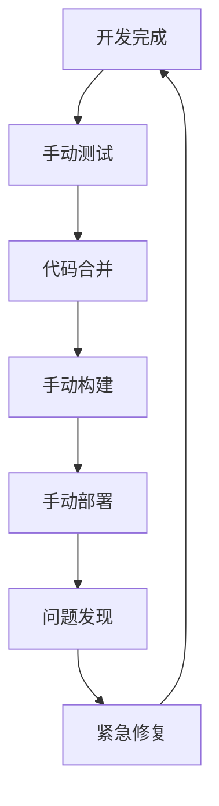

# 问题分析

## 问题概述

通过项目复盘，我们识别出以下三个核心问题领域，这些问题严重影响了项目的质量和交付效率。

## 1. 代码质量问题

### 1.1 代码评审不够深入

#### 问题描述
- Code Review流程存在但执行不够严格
- 评审重点关注语法和格式，忽略逻辑漏洞
- 缺乏针对C++特性的专项评审标准
- 评审后仍有大量运行时错误

#### 具体表现
```cpp
// 常见问题示例：
std::vector<int> data;
// 多线程环境下未加锁直接操作
data.push_back(value); // 潜在的竞态条件
```

#### 影响范围
- **严重程度**: 高
- **影响模块**: 所有核心模块
- **发现阶段**: 运行时/生产环境

### 1.2 多线程安全问题

#### 问题描述
- 容器类（如vector, map）在多线程环境下使用不当
- 锁的粒度控制不合理
- 死锁风险高
- 缺乏系统性的线程安全设计

#### 具体问题类型

##### 锁粒度问题
| 锁粒度 | 优点 | 缺点 | 风险 |
|--------|------|------|------|
| 粗粒度 | 实现简单 | 性能差，并发度低 | 性能瓶颈 |
| 细粒度 | 性能好，并发度高 | 复杂度高 | 死锁风险 |

##### 常见死锁场景
```cpp
// 场景1: 锁顺序不一致
Thread1: lock(mutex_a) -> lock(mutex_b)
Thread2: lock(mutex_b) -> lock(mutex_a)

// 场景2: 嵌套锁调用
void func1() { lock(mutex); func2(); }
void func2() { lock(mutex); /* deadlock */ }
```

#### 影响范围
- **严重程度**: 极高
- **影响模块**: 网络模块、线程模块、日志模块
- **发现阶段**: 压力测试/生产环境

## 2. 测试和质量保证问题

### 2.1 测试覆盖不足

#### 问题描述
- 单元测试覆盖率仅60%
- 缺乏多线程场景测试
- 集成测试不完整
- 缺乏性能回归测试

#### 测试现状分析
```
测试类型          覆盖率    质量评级    问题数量
单元测试          60%       中等        15+
集成测试          30%       较差        25+
性能测试          20%       差          10+
安全测试          10%       极差        未知
```

### 2.2 静态代码检查不足

#### 问题描述
- 缺乏系统性的静态代码分析
- 未集成内存检查工具
- 代码规范检查不严格
- 缺乏自动化检查流程

#### 建议工具集成
- **静态分析**: Clang Static Analyzer, PVS-Studio
- **内存检查**: AddressSanitizer (ASan), Valgrind
- **代码规范**: clang-format, clang-tidy
- **安全检查**: Coverity, SonarQube

## 3. 发布和部署问题

### 3.1 发布流程不规范

#### 问题描述
- 发布过程缺乏标准化流程
- 版本管理混乱
- 缺乏自动化部署
- 回滚机制不完善

#### 发布流程现状


### 3.2 生产环境问题频发

#### 问题描述
- 经过开发自测和QA验证的版本在生产环境仍出问题
- 业务接入后立即暴露问题
- 缺乏灰度发布机制
- 监控和告警不及时

#### 典型问题场景
1. **内存泄漏**: 长时间运行后内存持续增长
2. **性能退化**: 新版本性能明显下降
3. **兼容性问题**: 在特定环境下功能异常
4. **并发问题**: 高并发场景下出现崩溃

## 问题根因分析

### 技术层面
1. **缺乏系统性的质量保证体系**
2. **工具链不完善**
3. **测试策略不全面**
4. **监控体系不健全**

### 流程层面
1. **代码评审标准不明确**
2. **发布流程不规范**
3. **风险控制机制缺失**
4. **问题反馈循环不及时**

### 人员层面
1. **质量意识有待提升**
2. **技能培训不足**
3. **责任分工不明确**
4. **经验总结不系统**

## 问题优先级排序

| 优先级 | 问题类别 | 影响程度 | 解决紧急度 | 预计工作量 |
|--------|----------|----------|------------|------------|
| P0 | 多线程安全问题 | 极高 | 紧急 | 4-6周 |
| P1 | 代码评审深度 | 高 | 高 | 2-3周 |
| P2 | 自动化测试 | 高 | 高 | 6-8周 |
| P3 | 发布流程规范化 | 中 | 中 | 3-4周 |
| P4 | 监控告警体系 | 中 | 中 | 4-5周 |

## 问题影响评估

### 业务影响
- **用户体验**: 崩溃和性能问题直接影响用户体验
- **业务稳定性**: 生产环境问题影响业务连续性
- **开发效率**: 频繁的问题修复影响新功能开发
- **团队士气**: 持续的质量问题影响团队信心

### 技术债务
- **维护成本**: 问题修复占用大量开发资源
- **扩展性**: 质量问题限制了功能扩展
- **可靠性**: 影响整体系统可靠性
- **安全性**: 潜在的安全风险

---

> ⚠️ **重要提醒**: 这些问题需要系统性解决，不能头痛医头、脚痛医脚。建议按优先级制定详细的改进计划。
